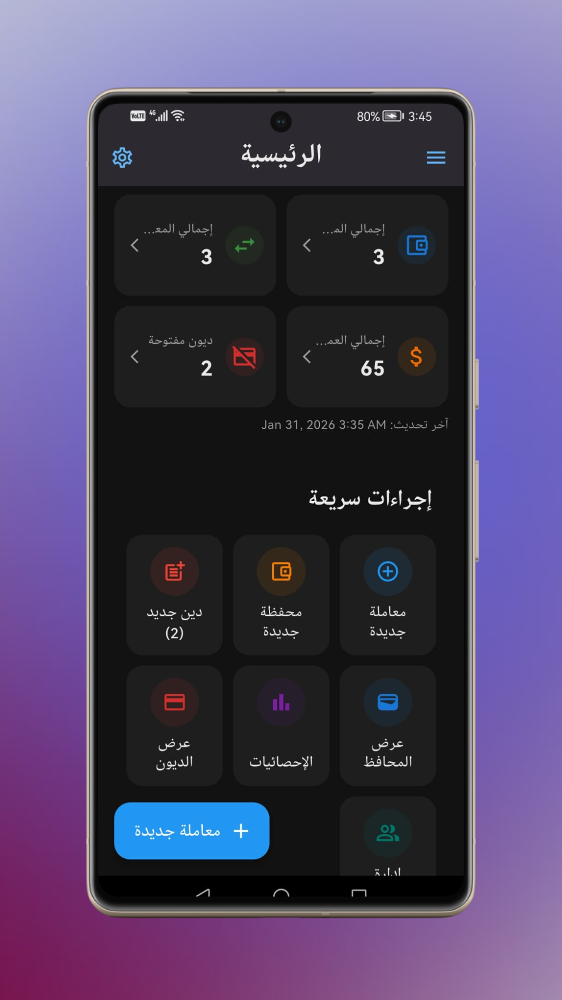
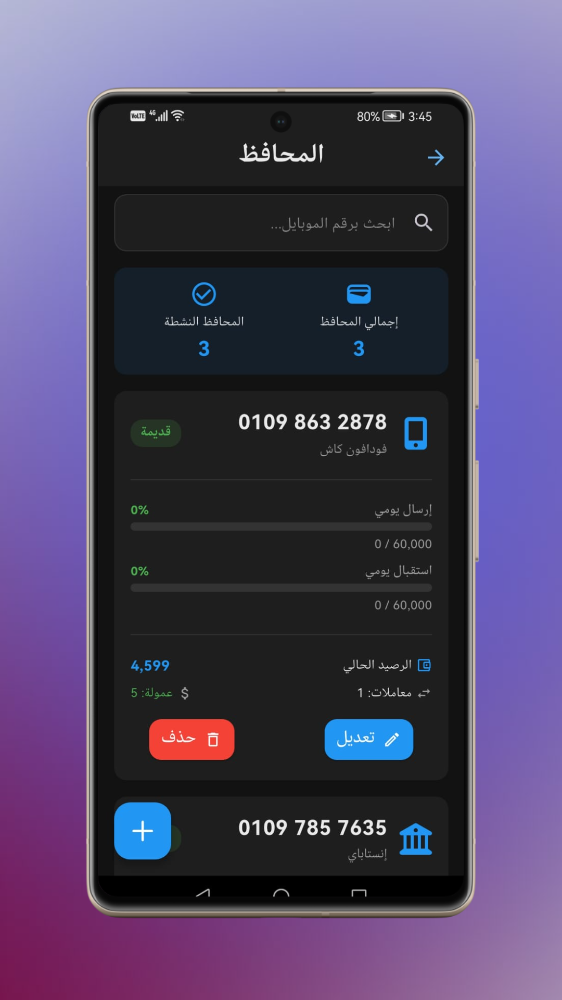
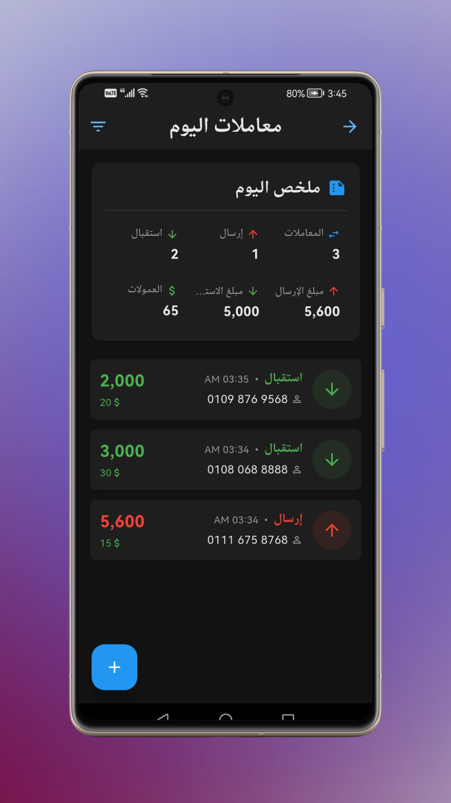
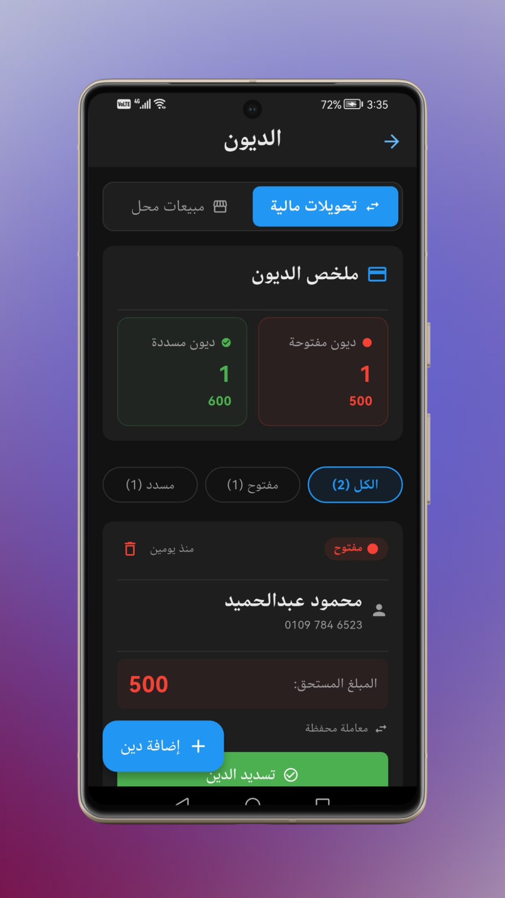

<div align="center">

# 💸 Wallet Manager
### Advanced Digital Wallet & Financial Management for Stores

<!-- Badges -->
[](https://flutter.dev/)
[](https://firebase.google.com/)
[]()
[]()

<br />

<!-- DOWNLOAD BUTTON -->
<a href="https://drive.google.com/drive/folders/1JAbu5a8COLMpTgSXJsPSxh3M8OOI_-VQ?usp=sharing" target="_blank">
  
</a>

<br />
<br />

**Wallet Manager** is a specialized Flutter application tailored for the **Egyptian market**, designed to help store owners manage multiple digital wallets (Vodafone Cash, InstaPay, etc.), track debts, and control employee access securely.

</div>

---

## 📸 App Screenshots

| Financial Dashboard | Multi-Wallet Support | Transaction Handling | Debt Management |
|:---:|:---:|:---:|:---:|
|  |  |  |  |

---

## 🚀 Key Features

### 💼 Smart Wallet Management
*   **Multi-Provider Support:** Seamlessly manage **Vodafone Cash, Etisalat, Orange, WE, and InstaPay**.
*   **Limit Enforcement:** Automatically tracks daily/monthly limits based on wallet type (New/Old/Registered) to prevent errors.
*   **Fee Calculation:** Auto-calculates service fees and commissions tailored to Egyptian service providers.

### 🔐 Security & Role-Based Access
*   **Owner Dashboard:** Full control over statistics, settings, and financial reports.
*   **Employee Mode:** Restricted access via **Secure PIN System**. Employees can perform transactions without viewing sensitive profit data.
*   **License System:** App usage is secured via a custom license key mechanism.

### 📝 Comprehensive Ledger
*   **Debt Tracker:** Record customer debts, manage partial payments, and track status (Open/Paid).
*   **Transaction History:** Detailed logs with filtering by date, type (Send/Receive), and provider.
*   **Performance Analytics:** Daily reports on profits, transaction volume, and cash flow.

---

## 🛠️ Technical Architecture

The project is built using **Clean Architecture** principles with the **MVVM** pattern.

| Component | Technology |
|:--- |:--- |
| **State Management** | `provider` (View Models) |
| **Backend** | Firebase (Firestore & Auth) |
| **Auth** | Google Sign-In & Custom PIN Logic |
| **Localization** | Arabic (`ar`) & English (`en`) support |
| **Utilities** | `shared_preferences`, `intl`, `bot_toast` |

### 📂 Project Structure

```text
lib/
├── core/                   # Constants, Themes, Utilities
├── data/                   # Repositories & Firebase Services
├── presentation/           # UI Screens & Widgets
├── providers/              # ViewModels (Business Logic)
└── l10n/                   # Localization (Arb files)
```

⚙️ Setup & Installation
1. Clone the Repo:
  git clone https://github.com/amrloulah-dev/wallet-manager-flutter.git
2. Firebase Setup:
  Note: This project relies on Firebase. You need to provide your own configuration files.
  Add your google-services.json to android/app/.
  Add your GoogleService-Info.plist to ios/Runner/.
Run:
  flutter pub get
  flutter run

<div align="center">
Developed with ❤️ by <a href="https://github.com/amrloulah-dev">Amr Loulah</a>
</div>
